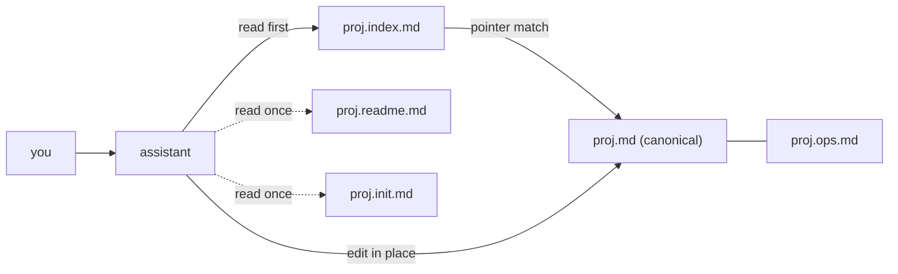

# projmemgr

**A self-updating memory for your projects, written in plain Markdown files.**

Status: early release - v0.1.0-alpha.

---

## 🎯 Purpose

Some model platforms now ship their own memory toggle - this is not that, and it isn't
trying to replace it. Platform memory is a global, ever-growing blob about you across
every conversation.

projmemgr is **managed** memory instead: scoped to one closed, ongoing project, kept in
a hosted doc you already use (Notion, in the examples here).

Pulling in the relevant fact should not also risk dragging in unrelated past
conversations or queries - a general concern with broad, unscoped memory that can mean
slower or noisier answers. That is not a measured benchmark claim, just the reasoning
behind the design.

It's for projects that run across many sessions and need one place where the facts
stay straight, not for open-ended chat memory in general. No code, no tool to install,
nothing to configure beyond copying a few Markdown files into a doc you already have.

## 🚀 Quickstart

### How to use

You just talk to your assistant normally - there is no command to learn and no "save"
button to press.

Say you mention, in the middle of an ordinary conversation, that a subscription price
went up. The assistant notices the fact is worth keeping, finds the one place it
already lives, updates just that detail, and quietly notes the date it changed.

Nothing else in the file moves, and nothing gets duplicated. Next time you ask about
your bills, the updated number is just there - the memory keeps itself current in a
plain file you can open and read yourself at any time.

### Set it up

> [!IMPORTANT]
> Your assistant must be able to **edit files in place** through a connector - whatever
> lets it read and write your store directly (e.g. a Notion MCP server or plugin), not
> just paste text into chat. Notion is the reference store. Read-only connectors do not
> work - the whole design collapses into "make a second copy." Test one edit before you
> invest further.

1. **Copy the templates.** Take the three files in [`templates/`](templates/) into your
   store and rename them `<slug>.md`, `<slug>.index.md`, `<slug>.ops.md` - the `slug` is
   just a short nickname for the project, e.g. `bills` or `health`.
2. **Send the kickoff message once.** Paste the block from *Kickoff prompt* under
   [Prompts](#-prompts) below into the project. It detects what already exists and
   proposes the slug, the one-sentence domain scope, and the `CAT-KEY` prefixes (the
   short stable ID each tracked item gets, e.g. `SUB-` for a subscription) for you to
   confirm or correct, then sets up (or repairs) the three files and seeds the facts it
   can find. It asks before writing.
3. **Paste the standing instruction.** Copy the block from *Standing instruction* under
   [Prompts](#-prompts) below into the project's custom instructions, filling the
   `{slots}` with the values step 2 just confirmed. This is what makes it save on its
   own, every turn from here on.
4. **Test it.** Ask a couple of questions, state a small change, confirm it updated the
   right line.

For the finished shape, see [`examples/bills/`](examples/bills/) - a complete, filled-in
example (with fake data).

## 🗺️ What's in here

```text
README.md               - you are here - overview, quickstart, prompts, file guide
LICENSE                 - MIT license text
spec/
+-- proj.readme.md      - shared behavior spec - the save-gate rules every project follows
`-- proj.init.md        - step-by-step guide for bootstrapping a new project's memory
templates/
+-- proj.md             - blank canonical memory file - copy and rename per project
+-- proj.index.md       - blank router/index file - copy and rename per project
`-- proj.ops.md         - blank ops file (health checks + automation deploy state) - copy per project
examples/
`-- bills/
    +-- bills.md        - filled-in canonical file for a fictional household-bills project
    +-- bills.index.md  - filled-in index for the same example
    `-- bills.ops.md    - filled-in ops file for the same example
```



## 🧠 How it works

- **Why the canonical file looks like this.** Headings give clean chunk boundaries. A
  curated index up front lets the assistant load a tiny list, route, and fetch only the
  one matching record - projmemgr's "progressive disclosure." Stable per-record IDs
  mean an edit lands on one line, never a second copy. Dense one-line records keep each
  fetch cheap; a prunable log degrades gracefully under context pressure.
- **Why the live-status block is JSON, not prose.** Models tend to respect JSON
  structure and are less likely to quietly rewrite or "improve" it than a paragraph of
  markdown - so the one block that must stay exact is written that way on purpose.
- **Why domain scope matters.** The assistant watches every turn for facts worth
  saving, unsupervised. A one-sentence statement of what the project actually covers is
  what stops that habit from also scooping up unrelated details from your life.
- **Why there are no empty sections.** An empty section costs tokens for nothing, and
  can invite the assistant to guess at filler rather than leave it honestly blank.
- **Why the index never holds numbers.** If it carried real values, every update to the
  canonical file would also mean updating the index to match - two sources of truth
  that will eventually disagree. Pointers only, so it stays valid no matter what
  changes underneath.
- **What the log is, and isn't.** It keeps *current* state correct, not a permanent,
  queryable history. For real bi-temporal querying ("what did we believe on date X"),
  reach for a purpose-built temporal store such as Zep or Graphiti instead.

## 📋 Prompts

The two messages below are the entire former `prompts/` folder, now folded in here -
nothing outside this section references `prompts/` anymore.

<details>
<summary><strong>Standing instruction</strong></summary>

Paste into the project's custom instructions so the assistant re-reads it every turn.
Fill in each placeholder using the slot key below first.

```text
Ongoing context ({STORE}, via connector) - keep it as a self-updating knowledgebase:
- Read {INDEX} first; fetch a record from {CANONICAL} only on a pointer match; answer which/where/exists from the index alone.
- Save on your own judgment (I should NOT have to say "save"): each turn, watch for durable, decision-relevant facts in this project's domain ({DOMAIN_LIST}). On spotting one, persist unprompted: new -> create a CAT-KEY record ({PREFIXES}); changed -> update that record's id line in place; then append one [LOG] line, bump STATE, confirm in one line.
- Per fact decide: DISCARD chatter/one-off/hypothetical/out-of-scope; WRITE/UPDATE durable in-scope facts; if important but unclear, incomplete, or conflicting -> ask one line or park in [GAP]. Never guess, never duplicate.
- Guardrails: stay in this project's domain (don't store unrelated personal life); never auto-store secrets (passwords, full ID/card numbers) - mask or store a reference; if a fact contradicts a stored source, flag for yes/no, don't overwrite.
- Never make a second copy or rewrite the whole file; refresh {INDEX} only on a section/id/flag change. If the connector is off or a write fails, say so and hold. Re-verify a record when you use it and it is past its freshness horizon, or when a new fact contradicts it; run the probe + dedup pass in {OPS} when past STATE.review_due. Full spec: proj.readme.md.
```

Slot key:

- `{STORE}` - the store name (e.g. `notion`).
- `{CANONICAL}` - `<slug>.md`.
- `{INDEX}` - `<slug>.index.md`.
- `{OPS}` - `<slug>.ops.md`.
- `{DOMAIN_LIST}` - the project's one-sentence scope, as a short list.
- `{PREFIXES}` - the project's CAT-KEY prefixes.

Keep it short - a longer instruction lowers adherence; only load-bearing rules belong
here.

</details>

<details>
<summary><strong>Kickoff prompt</strong></summary>

Send this once, at any stage, to build or repair a project's memory context - empty,
half-built, or due for an audit. A one-off message, not the standing instruction above.
Byte-identical to `spec/proj.init.md` PHASE 12's numbered setup steps.

```text
Set up (or repair) this project's memory context.

1. Read proj.init.md - the bootstrap guide - and proj.readme.md for behavior. Follow them; do not invent a different structure. If the connector is off or unreachable, say so and stop.
2. Detect the current state BEFORE writing anything: search the workspace for this project's canonical file, its index, its ops file, and an instance part in proj.readme.md section 10.
   - Nothing exists -> run PHASE 0-10 for a new context.
   - Something exists -> never create a second copy: audit what is there against the spec, list what is missing, wrong, or duplicated, and repair it in place.
3. Ask me only what you cannot infer - the slug, the one-sentence domain scope, and the CAT-KEY prefixes - and propose your best answer for each so I can just confirm or correct.
4. Show a short plan first (files to create or change, prefixes, what gets seeded, what stays open) and wait for my go before writing.
5. On approval, execute: create or repair the canonical file, index, and ops file; add this project's instance part to proj.readme.md section 10; wire the three-directional LINKS; seed only facts you can source - anything unverified goes to [GAP], never guessed; mask secrets.
6. Verify every write (the Write-Verification Rule). A success response is NOT proof - a multi-operation edit can silently skip parts. Re-fetch the page, or re-run the same edit as a single operation; treat "No matches found" as proof only when that string was short and unique, since with a long string it usually means the stored text differs. Prefer short targeted edits and verify one by one. Report anything that failed instead of claiming done.
7. Finish by printing (a) the filled PHASE 10 paste prompt for this project, and (b) the first-run validation checklist 9.1-9.6 so I can test it.

Rules throughout: one canonical copy; edit in place, never rewrite whole files; never duplicate a record; stay inside this project's domain; never store passwords or full ID/card numbers.
```

Send it as your next message - the assistant will report what it found, propose a
short plan, and wait for your go-ahead before writing anything.

</details>

## ⚙️ Automation

<details>
<summary>Optional: hands-off capture</summary>

Goal: new source data (a file, an email, a row) becomes a record with no manual step -
deduped, logged with a dated entry, flagged for a human only when low-confidence. Pick
an orchestrator that talks to your store's API directly, not a platform automation tied
to a paid tier you might drop: n8n (self-hostable, recommended), or Zapier / Make /
Pipedream / Composio.

Data flow: trigger on new data -> extract text (OCR if needed) -> an LLM maps it to
your record schema plus a candidate stable ID -> match/dedup by that ID -> update in
place or create, append a log line, bump the version -> low-confidence or conflicting
items get flagged for a human instead of silently overwritten.

One-time setup: create an API token/integration for the store, grant it access, add the
credentials in the orchestrator, build the steps above, dry-run on samples, then
enable. Dedup rule: match on the stable ID, newest write wins, logged for auditability.
After deploy, keep spot-checking - including that automated writes land on the record
you actually expect.

</details>

## ⚠️ Limits

- Automatic capture only sees what actually comes up in chat, is recognition-based, and
  is best-effort - a fact it should have caught can be missed, and that miss is silent.
- Because of that, the reconcile (probe + dedup) pass is not an optional extra - it is
  the mandatory safety net that catches what autonomous capture didn't.
- The change log keeps current state correct, not a point-in-time history. If you need
  real bi-temporal querying (what did we believe as of a given date), reach for a
  purpose-built temporal store such as Zep or Graphiti instead.

## 📄 License

[MIT](LICENSE) - use freely. The example data is fictional.
